<p align="right">
  <a href="README.md">简体中文</a> |
  <a href="README-en.md">English</a>
</p>

# 说明

Free-Fitness 是使用 Flutter 开发的集运动训练、饮食记录、日记编写等功能为一体的健身饮食记录管理 App。

此 App 适合拥有运动健身、减肥增肌、饮食记录、随手记等需求的辅助使用。所有数据全部在本地，~~无需联网，且默认无内置数据，自定性比较灵活。~~

- 2025-08-01: 为方便直接使用，`0.2.2-beta.1`及其之后可能存在的版本，会内置部分数据：
  - "基础动作"：Github 源库 [yuhonas/free-exercise-db](https://github.com/yuhonas/free-exercise-db)，使用的是 fork 仓库的动作数据和图片
  - “食物成分”：《中国食物成分表标准版(第 6 版)》中的营养成分数据 [Sanotsu/china-food-composition-data](https://github.com/Sanotsu/china-food-composition-data)
  - **注意**：仅全新初次使用才会初始化内置数据，App 未卸载的直接升级或覆盖恢复，不会初始化内置数据
    - 可以在“基础动作”和“食物成分”主页右上角执行“加载内置数据”，会替换已存在的同名/同代号的数据

## 更新

- 2025-08-01 `0.2.2-beta.1`
  - 内置部分“基础动作”和“营养成分”数据，方便直接使用
- 2024-12-03 `0.2.1-beta.1`
  - 主要接入零一万物 AI 大模型 API，对饮食记录和餐食照片进行 AI 分析和问答式提供建议。

更多改动参看 [CHANGELOG](CHANGELOG.md)

_2025-02-11_

如果对在线大模型 API 平台 [硅基流动](https://siliconflow.cn/zh-cn/models) 感兴趣，还能用下我的邀请码注册，那就十分感谢了：

[https://cloud.siliconflow.cn/i/tRIcST68](https://cloud.siliconflow.cn/i/tRIcST68)

## 功能说明

对于保持健康身体的最普遍要求，是合理的运动和饮食。

应用主要功能如下：


### 运动模块

用户可以自己表单添加、或者按照指定 json 格式批量导入基础的运动动作，然后以此来制作训练及计划。比如

- 首先创建或导入(内置了一部分)**动作(TrainingAction)**，比如坐姿举腿、卷腹、仰卧蹬车、坐姿转体
- 然后就创建一个**训练(TrainingGroup)**，比如“腹肌锻炼”，添加这些动作，坐姿举腿 30 秒重复 5 组，卷腹 20 次重复 3 组等。
- 如果训练足够多，甚至可以列一个**训练计划(TrainingPlan)**，比如第一天“腹肌训练”，第二天“腿部训练”，第三天“胸部训练”……

有了“训练”或“训练计划”后，就可以选择某个训练内容进行**跟练**，app 提供显示动作跟练倒计时进行辅助。

#### 基础动作

列表中**向左滑进行删除**。

可以直接导入指定格式的 json 文件(下详)或者表单新增动作，数量较少时表格展示；当然可以随时点击查看详情或者修改动作信息。

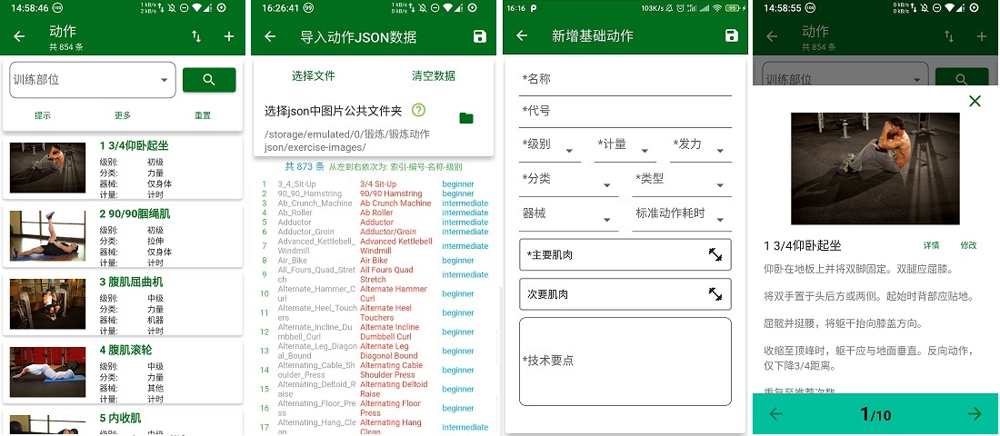

#### 训练做组

训练列表和计划列表是**长按删除**。

新增一个训练之后，需要添加指定动作并进行配置，根据动作是计时或者计次显示时间或者次数，有器械负重也可能添加。

在修改训练中的动作时，长按可以拖拽排序，删除按钮可以移除条目，点击条目可以修改持续时间/次数和负重配置。

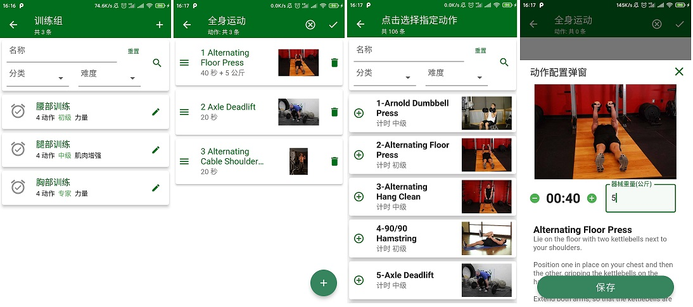

#### 周期计划

计划模块和训练基本类似，也是创建好计划的基本信息之后，添加已经存在的训练。

**一个计划就是一组训练，一个训练就是一组动作**。

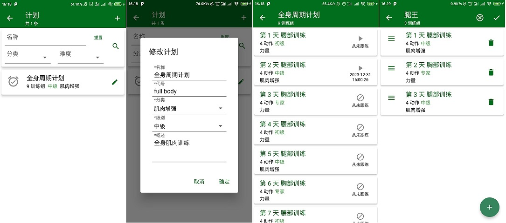

#### 跟练页面

在选择某个指定训练或者计划的某一个训练日之后，点击开始可以进行跟练，有简单的 TTS 语音提示。

- 注意，需要手机有安装 TTS 引擎

倒计时的时间，就是配置时设定的动作时间，其中动作是计时的，则是直接设定的时间；如果动作是计次的，倒计时是`次数 * 完成一个标准动作的耗时`。

跟练过程中可以跳过、重复等操作，完成之后还可以重新再来。

每完成一次都有非常简单的训练报告。

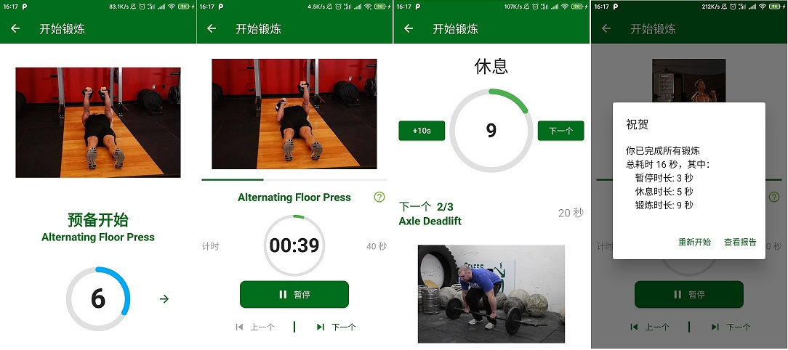

#### 运动报告

运动报告统计每次训练跟练的名称、持续时间等信息。还可以按需要导出为 pdf 文件。

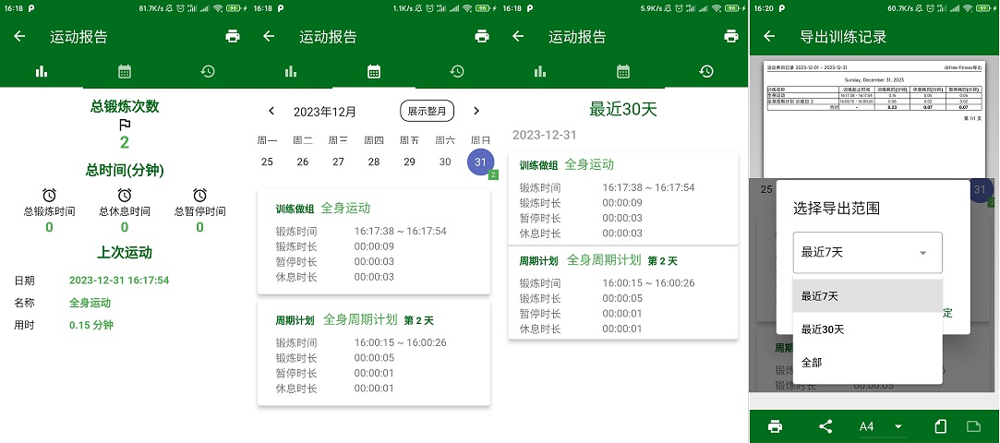

### 饮食模块

饮食模块类似，主要提供以下功能:

- 首先需要有一些食物及其成分数据可以进行选择(**食物成分**模块)
- 再记录每天一日四餐吃了什么食物，选择食物和记录食用量(**饮食日记**模块)
- 可以拍照或者选择相册图片简单记录一下饮食内容(**餐食相册**模块)
- 最后按照时间周期统计一下食物及营养素的摄入量，看看是否符合健康要求(**饮食报告**模块)

#### 食物成分

食物成分的列表（内置了一部分）展示是食物名称信息，但食物的单份营养素可以不一样。比如一个单份是 `100 克 200 大卡`，还有一个单份是 `1 只 300 大卡`。有多个单份营养素信息时，表格更直观。

食物成分主要是添加一些食物营养素信息，可以按照指定格式 json(下详)导入或者表单新增。

**长按可删除**指定食物(暂时无批量删除)

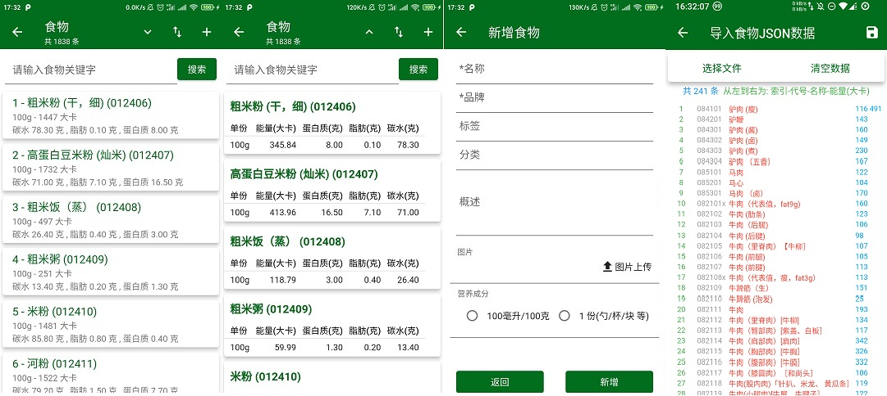

对于食物的详情页面，可以对该食物进行修改，对单份营养素进行修改。

新增食物营养素有两种单位，一种是默认的 `100g/100ml` 的标准，一种是比较宽松的`1份`。

选中某个单位营养素数据之后，也可以进行修改删除等操作。

目前导入食物没有导入图片的逻辑，所以食物的图片可以在此处修改。

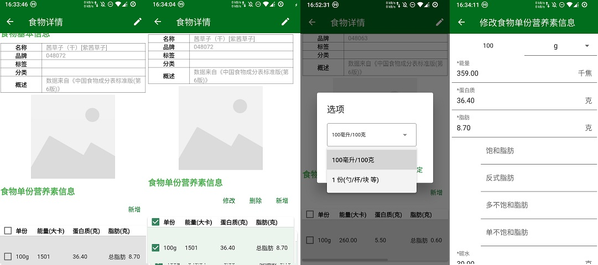

#### 饮食日记

饮食记录是比较核心的功能，用于记录一日三餐再额外一个小食(其他零食、夜宵之类的可以放在这里)共四餐的摄入信息。

选择指定的食物，输入摄入量，如果有对应的食物营养素信息，就可以大概了解今天整体的能量摄入，有简单的统计和图表，页面右上角日历按钮，点击可以按日历看到每天摄入能量，更好地管理饮食。

每餐都可以上传照片，记录一下当日当餐吃了哪些东西，后续也可以在餐食相册中统一查看。

当日有饮食记录，**可以点击右下角对话图标按钮，进行 AI 分析**。

- 会将当日摄入的食物以及营养素传入，调用 AI 大模型进行分析，可以简单多轮对话
- 此处大模型使用零一万物`yi-lightning`，需要修改平台及模型、提示词等内容，需要自己修改代码

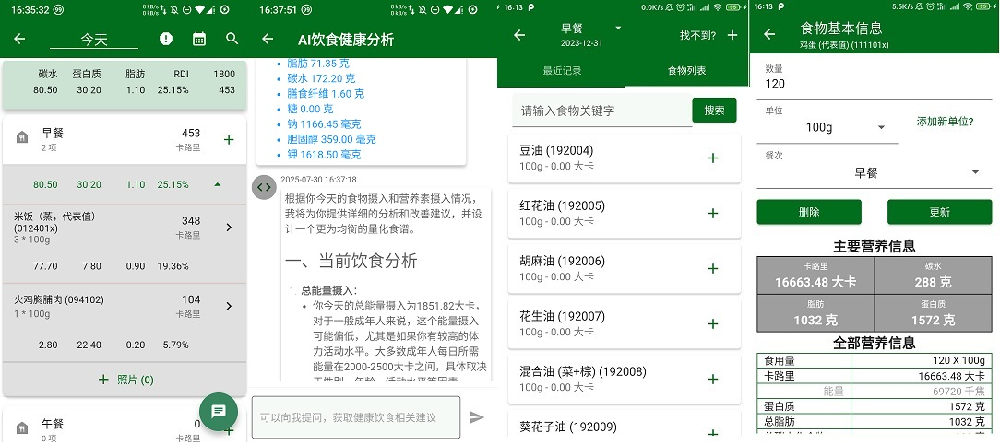

#### 餐食相册

可以集中浏览保存的餐次图片，可选择相册图片或拍照。

在饮食记录的照片页面或在餐食相册页面，也可以进行 AI 分析

- 图片分析使用的零一万物`yi-vision-v2`
- AI 分析目前只处理单张图片（餐次有多张照片默认处理第一张）

因为自付费，我的账户余额不足可能就没法继续使用 AI 分析功能了，有需要则自行修改代码


#### 饮食报告

除了每日饮食记录页面下方的单日统计，还有集中的饮食摄入统计，可以查看最多最近两周的饮食摄入，比如摄入食物的种类次数和摄入量，主要营养素的量等等。

当然也可以指定范围将报告导出为 pdf 文件。

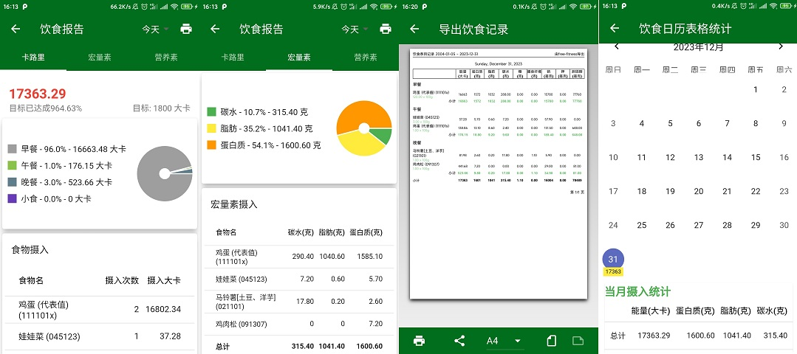

### 手记模块

手记(日记)模块一开始是为了方便快速记录而额外添加的。比如我今天跑步 10 公里，吃了一只烧鸡，但我不需要看 app 自带的报告，我自己简单记录一下就好。

手记提供富文本编辑器，自己随意添加任何信息，支持添加图片等。

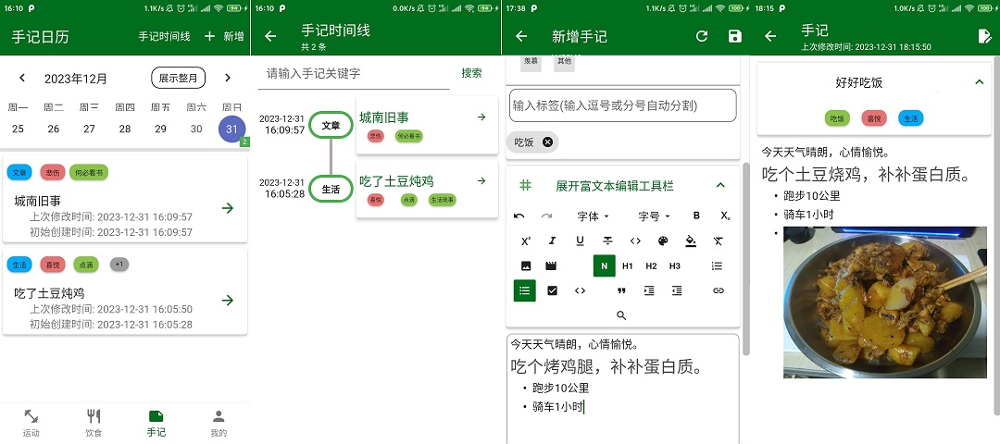

### 用户与设置

主要就是一些用户信息管理，体重记录管理，每日摄入目标，全量备份和覆盖恢复，切换语言和主题之类的。

其中全量备份是把内置数据库的数据全部导出为 json 文件后构建一个 zip 压缩包，后续其实不一定是真的 app 备份的 zip 文件，只要格式一致，自行压缩的 zip 文件也可以恢复。

**注意，如果要卸载或者升级版本，建议先进行一次全量备份，再次安装时首先进行覆盖恢复。**

英文和深色主题并没有完全适配，可以有些差异。

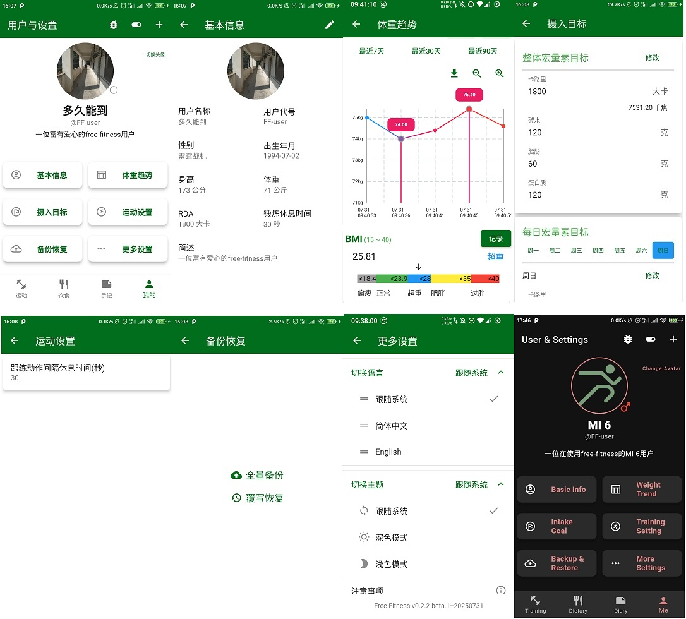

## 使用说明

2025-08-01: `0.2.0-beta.1`及其之后的版本需要联网了，但仅限于调用在线大模型 API，和运动基础动作或食物的在线图片。

### 少量权限

~~app 无需联网，~~ 但是为了导出 pdf 和备份恢复，会请求存储访问权限，不授予也没关系，只是该功能不可使用，不影响其他功能。

- 2025-08-01: 因为添加了对饮食记录的 AI 分析功能，需要调用 AI 大模型 API，所以需要联网了。

### 敏感信息

~~app 都无需联网，所有的数据都在本地缓存、内置的 sqlfite 中，就算添加网络图片地址都不一定能打开(代码中全是`File(path)`)。~~

- 2025-08-01: 同上，但除了内置运动的基础动作的图片是 Github 上的网络地址，其他所有数据也都在本地，比较符合隐私需求。

### 数据格式

关于运动模块最重要的“**动作**”数据，可以参看 github 的这个仓库[yuhonas/free-exercise-db](https://github.com/yuhonas/free-exercise-db)，完全兼容。

但为了方便，可以额外增加两个栏位：为了区分计时或者计数的`countingMode`(timed 或者 counted)，和计次时完成一个标准动作需要的耗时`standardDuration`。

如果没有的话默认为 `timed`计时和 `1` 秒。

```json
[
  {
    "id": "Sit-Up",
    "name": "仰卧起坐",
    "force": "pull",
    "level": "beginner",
    "mechanic": "isolation",
    "equipment": "body only",
    "primaryMuscles": ["abdominals"],
    "secondaryMuscles": [],
    "instructions": [
      "平躺于地面，将双脚固定于稳固物体下或让同伴协助固定，双腿膝盖弯曲。",
      "双手交叉扣于后脑勺，保持此姿势为起始位置。",
      "抬起上半身形成与大腿呈想象中的V字造型，此过程需呼气。",
      "感受腹部收缩1秒后，缓慢吸气将上半身放回起始位置。",
      "重复推荐次数即可"
    ],
    "category": "strength",
    "images": ["Sit-Up/0.jpg", "Sit-Up/1.jpg"],
    "countingMode": "counted",
    "standardDuration": "2"
  }
  //...
]
```

注意，这里运动动作的图片可以是多张，然后这里的地址是图片文件夹相对路径。

所以上传时要选中这 `images` 栏位中相对路径的图片文件夹(即地址公共前缀)，上传时才会将两者的地址何必到一起，否则会直接存入这个相对路径的地址，就看不到图片了。

- 如果数据中是网络图片地址，则无需选择图片文件夹直接导入 json 即可

**2025-08-01 特别注意**

由于之前代码是刻意匹配 [yuhonas/free-exercise-db](https://github.com/yuhonas/free-exercise-db) 的 json 结构，所以针对下面栏位，是需要满足特殊处理英文值的，否则在查询、显示等情况时，可能无法正确匹配。

中英文可查看代码中常量的定义 [constants.dart](lib/core/constants/constants.dart) 。

导入的 json 中，**这些栏位，必须要使用符合`free-exercise-db`中 json 的英文枚举值**:

- force
  - pull 、 push 、 static 、 other
- level
  - beginner 、 intermediate 、 expert
- mechanic
  - isolation 、 compound
- category
  - strength 、 stretching 、 plyometrics 、 power lifting 、
  - strongman 、 cardio 、 anaerobic 、 other
- equipment
  - body 、 body only 、 barbell 、 dumbbell 、 cable 、
  - kettlebells 、 bands 、 edicine ball 、 exercise ball 、 foam roll 、
  - e-z curl bar 、 machine 、other
- primaryMuscles 或 secondaryMuscles
  - quadriceps 、 shoulders 、 abdominals 、 chest 、 hamstrings 、
  - triceps 、 biceps 、 lats 、 middle back 、 calves 、
  - lower back 、 forearms 、 glutes 、 trapezius 、 adductors 、
  - abductors 、 neck 、other
- countingMode
  - counted (记次) 、 timed(计时)

参看：[yuhonas/free-exercise-db 中的各个查询条件的值](https://lite.datasette.io/?json=https://github.com/yuhonas/free-exercise-db/blob/main/dist/exercises.json#/data/exercises?_facet_array=primaryMuscles&_facet_array=secondaryMuscles&_facet=force&_facet=level&_facet=mechanic&_facet=equipment&_facet=primaryMuscles&_facet=category)。

---

关于饮食模块最重要的“**食物成分**”数据，目前我没有找到对应的仓库，而是将 pdf 版本的[《中国食物成分表标准版（第 6 版）》](https://www.pumpedu.com/home-shop/5514.html) 中“能量和食物一般营养成分”部分进行截图，并通过 python 脚本处理，并进一步构建成指定格式的 json 文件。测试数据也放在了 github 中 [Sanotsu/china-food-composition-data](https://github.com/Sanotsu/china-food-composition-data) 。

但实际的 json 格式不必要这么多栏位，简单满足以下即可，多的用不到：

**（当然，会被默认当成 100g 可食用部分的营养素信息）**

```json
[
  {
    "foodCode": "091101x",
    "foodName": "鸡 (代表值)",
    "energyKCal": "145",
    "energyKJ": "608",
    "protein": "20.3",
    "fat": "6.7",
    "CHO": "0.9",
    "dietaryFiber": "0.0",
    "cholesterol": "106",
    "Na": "62.8",
    "tags": "肉",
    "category": "荤",
    "photos": [
      "<设备中的完整路径>/0.jpg",
      "<设备中的完整路径，暂时不用传>/0.jpg"
    ]
  }
  // ...
]
```

- 如果不是《中国食物成分表标准版（第 6 版）》结构的数据，那么`foodCode`请填写“食物品牌”，`foodName`填写“食物名称”。

基础的动作和食物成分 json 也可以单条数据的 json 文件，代码中发现不是`[]`包裹的数据会自动加上。

当然格式不对或者数据重复就无法导出了。一般就是动作或者食物的名称重复之类的。

## 其他说明

### 仅 Android

没有其他设备，所以相关内容为 0。

由于一开始只是自用而已，且主力机是努比亚 Z60Ultra(Andriod 14)，备用机是小米 6(Andriod 12)，都是 1080P 左右的完整屏幕，几乎肯定在其他的设备有一些显示上的差距，可以反馈或自行修改。

### 其实还存在很多的问题

<details>

<summary>一些可能还存在的问题，记不太清了</summary>

- 中英文和深色主题不算完全适配
- 很多数据库操作没有 try catch 等检查检测操作
- 许多同样逻辑的代码但写得五花八门
- 很多没用的组件代码块还保留，注释的代码还保留，甚至 print 都还保留

可是是单纯想在 2023 年完成一个测试版本吧，所以赶鸭子上架，后续会持续改进。

</details>

---

以上，如果有什么问题请不吝指导，谢谢。
