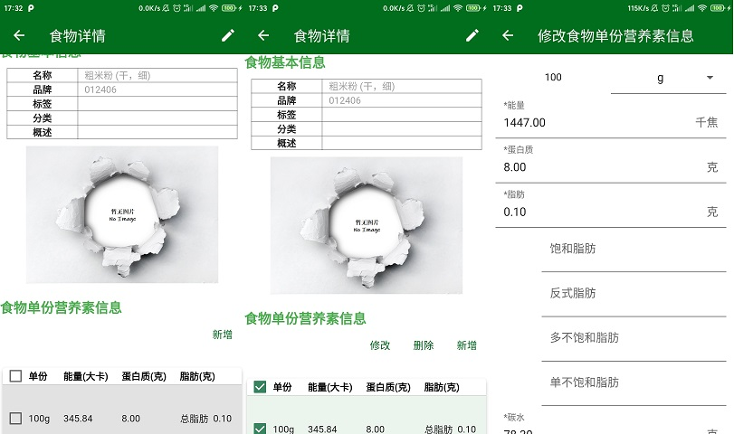
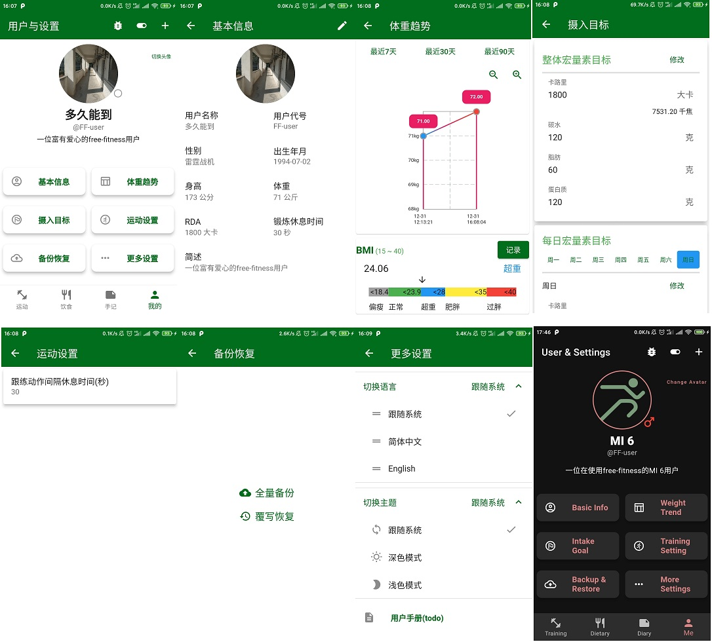

<!-- START doctoc generated TOC please keep comment here to allow auto update -->
<!-- DON'T EDIT THIS SECTION, INSTEAD RE-RUN doctoc TO UPDATE -->

- [说明](#%E8%AF%B4%E6%98%8E)
  - [版本更新](#%E7%89%88%E6%9C%AC%E6%9B%B4%E6%96%B0)
  - [功能说明](#%E5%8A%9F%E8%83%BD%E8%AF%B4%E6%98%8E)
    - [运动模块](#%E8%BF%90%E5%8A%A8%E6%A8%A1%E5%9D%97)
      - [基础动作](#%E5%9F%BA%E7%A1%80%E5%8A%A8%E4%BD%9C)
      - [训练做组](#%E8%AE%AD%E7%BB%83%E5%81%9A%E7%BB%84)
      - [周期计划](#%E5%91%A8%E6%9C%9F%E8%AE%A1%E5%88%92)
      - [跟练训练的页面](#%E8%B7%9F%E7%BB%83%E8%AE%AD%E7%BB%83%E7%9A%84%E9%A1%B5%E9%9D%A2)
      - [运动报告](#%E8%BF%90%E5%8A%A8%E6%8A%A5%E5%91%8A)
    - [饮食模块](#%E9%A5%AE%E9%A3%9F%E6%A8%A1%E5%9D%97)
      - [食物成分](#%E9%A3%9F%E7%89%A9%E6%88%90%E5%88%86)
      - [饮食日记](#%E9%A5%AE%E9%A3%9F%E6%97%A5%E8%AE%B0)
      - [餐食相册](#%E9%A4%90%E9%A3%9F%E7%9B%B8%E5%86%8C)
      - [饮食报告](#%E9%A5%AE%E9%A3%9F%E6%8A%A5%E5%91%8A)
    - [手记模块](#%E6%89%8B%E8%AE%B0%E6%A8%A1%E5%9D%97)
    - [用户与设置](#%E7%94%A8%E6%88%B7%E4%B8%8E%E8%AE%BE%E7%BD%AE)
  - [使用说明](#%E4%BD%BF%E7%94%A8%E8%AF%B4%E6%98%8E)
    - [少量权限](#%E5%B0%91%E9%87%8F%E6%9D%83%E9%99%90)
    - [敏感信息](#%E6%95%8F%E6%84%9F%E4%BF%A1%E6%81%AF)
    - [数据格式](#%E6%95%B0%E6%8D%AE%E6%A0%BC%E5%BC%8F)
  - [其他说明](#%E5%85%B6%E4%BB%96%E8%AF%B4%E6%98%8E)
    - [仅 Android](#%E4%BB%85-android)
    - [其实还存在很多的问题](#%E5%85%B6%E5%AE%9E%E8%BF%98%E5%AD%98%E5%9C%A8%E5%BE%88%E5%A4%9A%E7%9A%84%E9%97%AE%E9%A2%98)

<!-- END doctoc generated TOC please keep comment here to allow auto update -->

# 说明

Free-Fitness 是使用 flutter 3.x 开发的集运动训练、饮食记录、日记编写等功能为一体的健身饮食记录管理 App。

此 App 适合拥有运动健身、减肥增肌、随手记录等需求的辅助使用。所有数据全部在本地，无需联网，且默认无内置数据，自定性比较灵活。

## 版本更新

- 2024-07-13 `0.2.0-beta.1`
  - 主要接入零一万物 AI 大模型，对饮食记录进行 AI 分析和问答式提供建议。
  - 更多改动参看[CHANGELOG](CHANGELOG.md)

## 功能说明

对于保持健康身体的最普遍要求，是合理的饮食与锻炼。主要功能如下：


### 运动模块

用户可以自己表单添加、或者按照指定 json 格式批量导入基础的运动动作，然后以此来制作训练即计划。

比如添加了**动作**：坐姿举腿、卷腹、仰卧蹬车、坐姿转体，然后就创建一个“腹肌锻炼”的**训练**，添加这些动作，每个持续 30 秒，重复 5 组。

如果动作足够多，训练足够多，甚至可以列一个**训练计划**：比如第一天“腹肌训练”，第二天“腿部训练”，第三天“胸部训练”……

有了训练计划后，就可以根据训练内容就行跟练，app 提供显示动作跟练倒计时进行辅助。

#### 基础动作

列表中向左滑进行删除。

可以直接导入指定格式的 json 文件(下详)或者表单新增动作，数量较少时表格展示；当然可以随时点击查看详情或者修改动作信息。


#### 训练做组

训练列表和计划列表是长按删除。

新增一个训练之后，需要添加指定动作并进行配置，根据动作是计时或者计次显示时间或者次数，有器械负重也可能添加。

在修改训练中的动作时，长按可以拖拽排序，删除按钮可以移除条目，点击条目可以修改持续时间/次数和负重配置。


#### 周期计划

计划模块和训练基本类似，也是创建好计划的基本信息之后，添加已经存在的训练。

一个计划就是一组训练，一个训练就是一组动作。


#### 跟练训练的页面

在选择某个指定训练或者计划的某一个训练日之后，点击开始可以进行跟练，有简单的 TTS 语音提示。

倒计时的时间，就是配置时设定的动作时间，其中动作是计时的，则是直接设定的时间；如果动作是计次的，倒计时是`次数 * 完成一个标准动作的耗时`。

跟练过程中可以跳过、重复等操作，完成之后还可以重新再来。

每完成一次都有训练报告。


#### 运动报告

运动报告统计每次训练跟练的名称、持续时间等信息。还可以按需要导出为 pdf 文件。


### 饮食模块

对于“运动”，本应的**饮食模块**主要提供以下功能:

#### 食物成分

食物成分的列表展示是食物名称信息，但食物的单份营养素可以不一样。比如一个单份是 100g 是 200 大卡，还有一个单份是 1 只 200 大卡。有多个单份营养素信息时，表格更直观。

食物成分主要是添加一些食物营养素信息，可以按照指定格式 json(下详)导入或者表单新增。


对于食物的详情页面，可以对该食物进行修改，对单份营养素进行修改。

目前导入食物没有导入图片的逻辑，所以食物的图片可以在此处修改。



#### 饮食日记

饮食记录是比较核心的功能，用于记录一日三餐再额外一个小食(其他零食、夜宵之类的可以放在这里)共四餐的摄入信息。

选择指定的食物，输入摄入量，如果有对应的食物营养素信息，就可以大概了解今天整体的能量摄入，更好地管理饮食。

每餐都可以上传照片，记录一下当日当餐吃了哪些东西，后续也可以在餐食相册中统一查看。


#### 餐食相册

可以几种浏览保存的餐次图片。

目前保存图片是上传的，后续会增加直接拍照的方式。


#### 饮食报告

除了每日饮食记录页面下方的单日统计，还有集中的饮食摄入统计，可以查看最多最近两周的饮食摄入，比如摄入食物的种类次数和摄入量，主要营养素的量等等。

当然也可以指定范围将报告导出为 pdf 文件。


### 手记模块

手记(日记)模块一开始是为了方便快速记录而额外添加的。比如我今天跑步 10 公里，吃了烤鸡烤鸭，但我不想看 app 自带的报告，我自己简单记录一下就好。

手记提供富文本编辑器，自己随意添加任何信息，支持添加图片等。


### 用户与设置

主要就是一些用户信息管理，体重记录管理，每日摄入目标，全量备份和恢复，切换语言和主题之类的。

其中全量备份是把内嵌数据库的数据全部导出为 json 文件后构建一个 zip 压缩包，后续其实不一定是真的 app 备份的 zip 文件，只要格式一致，自行压缩的 zip 文件也可以恢复。

英文和深色主题并没有完全适配，可以有些差异。



## 使用说明

### 少量权限

app 无需联网，但是为了导出 pdf 和备份恢复，会请求存储访问权限，不授予也没关系，只是该功能不可使用，不影响其他功能。

### 敏感信息

app 都无需联网，所有的数据都在本地缓存、内嵌的 sqlfite 中，就算添加网络图片地址都不一定能打开(代码中全是`File(path)`)。

### 数据格式

关于运动模块最重要的“**动作**”数据，可以参看 github 的这个仓库[yuhonas/free-exercise-db](https://github.com/yuhonas/free-exercise-db)，完全兼容。

但为了方便，可以额外增加两个栏位：为了区分计时或者计数的`counting_mode`(timed 或者 counted)，和计次时完成一个标准动作需要的耗时`standard_duration`。

如果没有的话默认为 `timed`计时和 `1` 秒。

```json
[
  {
    "id": "Alternate_Incline_Dumbbell_Curl",
    "name": "Alternate Incline Dumbbell Curl",
    "force": "pull",
    "level": "beginner",
    "mechanic": "isolation",
    "equipment": "dumbbell",
    "primaryMuscles": ["biceps"],
    "secondaryMuscles": ["forearms"],
    "instructions": [
      "Sit down on an incline bench with a dumbbell in each hand being held at arms length. Tip: Keep the elbows close to the torso.This will be your starting position."
    ],
    "category": "strength",
    "images": [
      "Alternate_Incline_Dumbbell_Curl/0.jpg",
      "Alternate_Incline_Dumbbell_Curl/1.jpg"
    ],
    "counting_mode": "counted",
    "standard_duration": "2"
  }
  //...
]
```

注意，这里运动动作的图片可以是多张，然后这里的地址是图片文件夹相对路径。

所以上传时要选中这 `images` 栏位中相对路径的图片文件夹(即地址公共前缀)，上传时才会将两者的地址何必到一起，否则会直接存入这个相对路径的地址，就看不到图片了。

---

关于饮食模块最重要的“**食物成分**”数据，目前我没有去找对应的仓库，而是将 pdf 版本的[《中国食物成分表标准版（第 6 版）》](https://www.pumpedu.com/home-shop/5514.html) 中“能量和食物一般营养成分”部分进行截图，并通过飞桨 OCR 转为 exel 文件，并进一步构建成指定格式的 json 文件。测试数据也放在了 github 中 [Sanotsu/china-food-composition-data](https://github.com/Sanotsu/china-food-composition-data)。

但实际的 json 格式不必要这么多栏位，简单满足以下即可，多的用不到：

**（当然，会被默认当成 100g 可食用部分的营养素信息）**

```json
[
  {
    "foodCode": "大润发牌",
    "foodName": "鸡 (代表值)",
    "water": "70.5",
    "energyKCal": "145",
    "energyKJ": "608",
    "protein": "20.3",
    "fat": "6.7",
    "CHO": "0.9",
    "dietaryFiber": "0.0",
    "cholesterol": "106",
    "Na": "62.8",
    "tags": "肉",
    "category": "荤",
    "photos": [
      "<设备中的完整路径>/0.jpg",
      "<设备中的完整路径，暂时不用传>/0.jpg"
    ]
  }
  // ...
]
```

基础的动作和食物成分 json 也可以单条数据的 json 文件，代码中发现不是`[]`包裹的数据会自动加上。

当然格式不对或者数据重复就无法导出了。一般就是动作或者食物的名称重复之类的。

## 其他说明

### 仅 Android

手里没有 IOS 设备，所以相关内容为 0。

由于一开始只是自用而已，且主力机是小米 6(andriod9)，备用机是一加一代(andriod11)，都是 16:9 的 1080P 完整屏幕，几乎肯定在其他的设备有一些显示上的差距，可以反馈或自行修改。

### 其实还存在很多的问题

- 切换中英文后，弹窗的文字没有变，要有其他动作(比如点击)之后才改变为目标文字
  - 其中包括原生的日历等组件
- 中英文和深色主题不算完全适配
- 训练和计划的查询非常慢
- 很多数据库操作没有 trycatch 等检查检测操作
- 许多同样逻辑的代码但写得五花八门
- 很多没用的组件代码块还保留，注释的代码还保留，甚至 print 都还保留

可是是单纯想在 2023 年完成一个测试版本吧，所以赶鸭子上架，后续会持续改进。

以上，如果有什么问题请不吝指导，谢谢。
